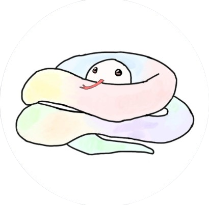
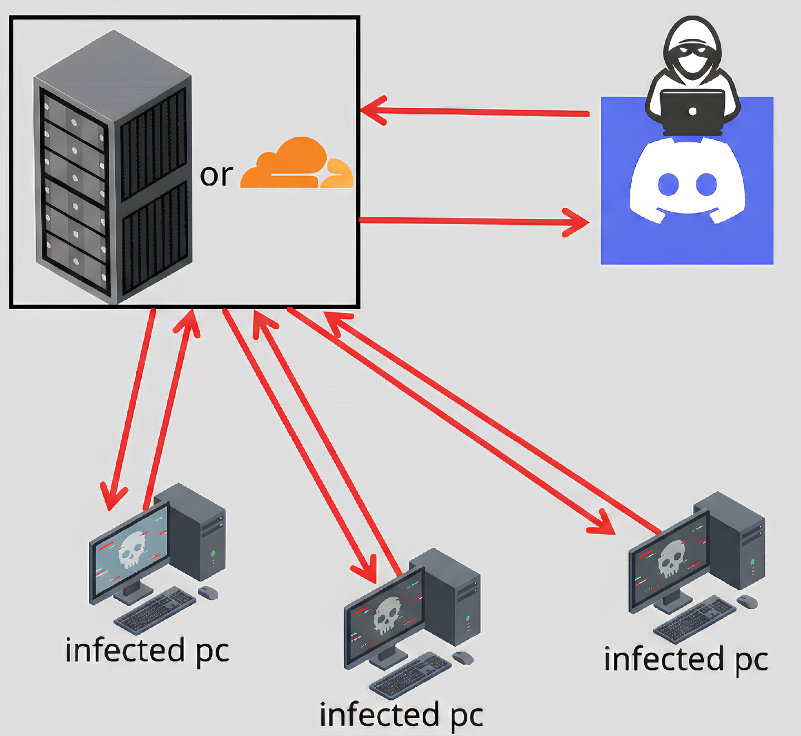

<div align="center">
  
  <h1>Snaky</h1>
  <p>Hybrid C/S Remote Access Trojan & Stealth Framework</p>
  
  <p>
    <b>❗ Notice: This project is under active development and may contain many bugs.❗</b><br>
    <sub>(주의: 제작 중이라 많은 버그가 포함되어 있을 수 있습니다.)</sub>
  </p>

  <p>
    
    
    
    
  </p>

  <p>
    
    
    
  </p>
</div>

---

## Introduction
Snaky is a Windows Remote Access Trojan (RAT) and Command & Control (C2) framework developed for PoC (Proof of Concept) purposes. 

Built with a hybrid architecture combining a high-performance Rust loader and a heavily obfuscated Nim stealth engine, it is designed to bypass modern EDR and AV solutions. This project integrates various attack techniques, fileless execution concepts, and real-time remote administration features.

## Disclaimer
This project was developed out of personal interest in cyber security research and EDR evasion techniques. Do not use this software for any illegal activities. 
The developer assumes no liability and is not responsible for any misuse or damage caused by this program. Use it only in authorized environments.

## Warning
Antivirus software or EDRs may detect certain components and automatically block or delete them during the build process or execution. This is normal and expected behavior for offensive security tools.

---

## Network Architecture

<div align="center">
  
</div>

### Detailed System Architecture
For a deep dive into how the Rust implant, Cloudflare Worker, and Nim Stealth Engine interact, refer to the technical guide.

<div align="center">
  
  <br>
  <br>
  <h3><a href="./ARCHITECTURE.md">View Full Technical Architecture Guide</a></h3>
</div>

---

## Commands Directory (CLI Tree)

The Discord C2 interface mirrors a traditional terminal experience. Here is the full breakdown of supported commands categorized by their internal module routing. Prefix all commands with `.` (configurable).

```text
root/
├── core/
│   ├── auth        - C2 authentication & registration.
│   ├── help        - List commands and detailed usage.
│   ├── info        - Target recon (OS, hardware, perms).
│   ├── ping        - Measure C2/Implant latency.
│   ├── shell       - Execute direct CMD/PowerShell.
│   ├── exit        - Shutdown the implant process.
│   ├── uninstall   - Remove persistence and self-delete.
│   └── refresh     - Restart the implant instance.
│
├── filesystem/
│   ├── ls & cd     - Directory listing and navigation.
│   ├── mkdir & rm  - Create or delete files/folders.
│   ├── cp & mv     - Copy, move, or rename paths.
│   ├── cat         - Read and display file contents.
│   ├── size        - Calculate path size recursively.
│   ├── pwd         - Print current working directory.
│   ├── search      - Find files using glob patterns.
│   ├── upload      - Drop files to target via Discord.
│   ├── download    - Exfiltrate files from target to C2.
│   └── zip & unzip - Compress or extract archives.
│
├── system/
│   ├── process     - Enum, kill, hollow, inject, or stomp.
│   ├── monitor     - Real-time CPU, RAM, Disk telemetry.
│   ├── visible     - Set executable window visibility.
│   ├── bsod        - Trigger instant Blue Screen of Death.
│   ├── crashps     - Crash target via PowerShell bomb.
│   ├── screen      - Control brightness or turn off panels.
│   ├── remote      - Live WebRTC-based screen share.
│   ├── record      - Record desktop to MP4 video.
│   ├── stealer     - Extract passes, tokens, and sessions.
│   ├── update      - OTA binary update (attachment/URL).
│   ├── volume      - Control system audio levels.
│   ├── windowops   - Manage active windows (min/max/close).
│   └── kctshell    - Silent execution via KCT hijacking.
│
├── utility/
│   ├── clipper     - Crypto-wallet address swapper.
│   ├── clipboard   - Get or set system clipboard text.
│   ├── jumpscare   - Fullscreen image + max volume audio.
│   ├── screenshot  - Capture multiple monitor displays.
│   ├── webcam      - Stealthy camera frame capture.
│   ├── foreground  - Sniff active window activity log.
│   └── openurl     - Launch URLs in the default browser.
│
└── crypto_net/
    ├── netinfo     - Public/Private IP & ISP metadata.
    └── nslookup    - Perform forward/reverse DNS queries.
```

---

## Compilation & Deployment

The deployment follows a logical sequence: **Infrastructure Setup -> Client Configuration -> Final Compilation.** 
Requires Rust (Windows GNU/MSVC) and Nim environments.

---

### Step 1: Deploy C2 Infrastructure
Before building the agent, you must have your C2 listener active to obtain your endpoint URLs.

#### Option A: Serverless (Cloudflare Workers) - *Recommended*
1. Install [Wrangler CLI](https://developers.cloudflare.com/workers/wrangler/install-setup/).
2. Deploy the proxy handlers:
   ```shell
   cd worker && wrangler deploy
   cd ../screen-share-worker && wrangler deploy
   ```
3. Copy the generated `.workers.dev` URLs.

> [!IMPORTANT]
> **Detailed Setup Guides:**
> - 📄 **[Proxy C2 Worker Setup Guide](./worker/SETUP.md)**
> - 📺 **[Screen Share Worker Setup Guide](./screen-share-worker/SETUP.md)**

#### Option B: Self-Hosted (Node.js Server)
1. Ensure Node.js 18+ is installed on your VPS.
2. Setup and start:
   ```shell
   cd worker && npm install && npm run start
   ```

---

### Step 2: Configure Client Settings
Now, inject your infrastructure details into the agent's source code.

1.  **C2 Endpoints**: Edit `snaky_rust_win/src/settings.rs`
    *   Paste your Cloudflare/VPS URLs into `C2_PRIMARY` and `C2_BACKUP`.
    *   Set a strong `SHARED_SECRET` (must match the secret in your Worker/Server config).
2.  **Stealth Identity**: Edit `snaky_rust_win/stego_strings.json`
    *   Customize command names and descriptions to evade pattern-based detection.
3.  **Visual Branding**: Replace `snaky_rust_win/assets/setting.ico`
    *   Simply overwrite this file with your desired `.ico` file to change the executable icon.

---

### Step 3: Multi-Stage Build Process

#### 1. Compile the Stealth Engine (Nim)
This generates the core evasion module.
```shell
cd nim_stealth
nim c -d:release --app:lib --cpu:amd64 --opt:size --out:../snaky_rust_win/stealth.dll libstealth.nim
```

#### 2. Encrypt Stealth Engine
Transform the DLL into a polymorphic blob using the XOR wrapper.
```shell
cd ../snaky_rust_win
python encrypt_stealth.py
```

#### 3. Compile the Final Implant (Rust)
The Rust compiler will bundle the encrypted Nim engine and the steganographic assets.
```shell
cargo build --release
```
The final, ready-to-use agent is located at: `target/release/snaky.exe`.

---

---

## Expectations (Soon)
- Quality Assurance (Refactoring & Bug Fixes)
- Linux Support (Cross-Platform Implementation)
- Additional Plugin Support
- Deep DNS Tunneling & C2 over DNS
- Advanced Rootkit Capabilities

---

## Demonstration

<div align="center">
  <video src="https://github.com/snake0074/snaky_c2_framework/raw/main/fdf.mp4" width="100%"></video>
</div>

---

---

## License
This project is licensed under the MIT License - see the [LICENSE](LICENSE) file for details.

## Acknowledgements
Salute to all cyber security professionals, malware researchers, and offensive tool developers who share their knowledge with the community!
